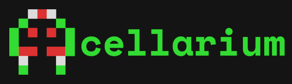

Cellular automata fingerpainting!

Cellular automata are fascinating and colorful, but what if they got *more* colorful? Whenever a cell changes state, it gets painted by the same-state cells in its neighborhood. This means isolated patches of cells share paint fairly quickly without trending directly to brown, but the whole system approaches brown very quickly.

## Controls
### Interaction
- *Left click* to draw cells
- *Right click* to draw state 0 cells (black)
- *Arrow keys* or *middle click* to pan
- *Scroll wheel* to zoom
### Parameters (+ Keyboard Shorcuts)
- **pen size**: Radius of drawing circle in pixels
- **pen state** (*1,2,3,4...*): Cell type to draw with
- **pause** (*spacebar*): Pauses simulation
- **step** (*S*): Pauses, advances simulation by a single step
- **steps per frame**: Number of simulation steps attempted per rendered frame
- **# states**: Interprets rule with this number of states (changing will require new rule)
- **preset**: Various preset rules
- **random rule** (*R*): Generates random rule
- **import rule from clipboard**: Imports compressed rule from clipboard text
- **export rule to clipboard**: Exports compressed rule as text to clipboard
- **rule from text**: Interprets input text as a rule (not the same as import)
- **mutate rule** (*M*): Randomly changes some rule parameters
- **simulation size**: Size of the simulation texture
- **clear** (*C*): Sets state of entire simulation space to 0
- **germinate from center** (*G*): Adds single state-1 cell to center, clearing everything else
- **fill randomly** (*F*): Sets all cells to random states
- **render states / paints**: Switch between coloring by a cell's state and its paint.

## Status & Feedback
This is a prototype. I stopped developing here to gather feedback about direction and future features.

## Issues
- For some reason, hitting 'random' seems to just... not happen sometimes.

Original README.md

Cellular automata zoo that runs in your browser! Simulate arbitrary multi-state rules on the GPU.

[*Play with it here!*](https://benpm.github.io/cellarium)

## Controls
### Interaction
- *Left click* to draw cells
- *Right click* to draw state 0 cells (black)
- *Arrow keys* or *middle click* to pan
- *Scroll wheel* to zoom
### Parameters (+ Keyboard Shorcuts)
- **pen size**: Radius of drawing circle in pixels
- **pen state** (*1,2,3,4...*): Cell type to draw with
- **pause** (*spacebar*): Pauses simulation
- **step** (*S*): Pauses, advances simulation by a single step
- **steps per frame**: Number of simulation steps attempted per rendered frame
- **# states**: Interprets rule with this number of states (changing will require new rule)
- **preset**: Various preset rules
- **random rule** (*R*): Generates random rule
- **import rule from clipboard**: Imports compressed rule from clipboard text
- **export rule to clipboard**: Exports compressed rule as text to clipboard
- **rule from text**: Interprets input text as a rule (not the same as import)
- **mutate rule** (*M*): Randomly changes some rule parameters
- **simulation size**: Size of the simulation texture
- **clear** (*C*): Sets state of entire simulation space to 0
- **germinate from center** (*G*): Adds single state-1 cell to center, clearing everything else
- **fill randomly** (*F*): Sets all cells to random states

## Scope
Totalistic 2D automata are a set of automata that include Conway's Game of Life, Wireworld, Brian's Brain, and more, which will be added as presets soon. Help me find new interesting rules to include in the presets!

## How it Works
Rules are represented by linear byte arrays that are packed into 2D textures. To determine state change for a given cell, the texture is accessed by 1D index.

This 1D index is calculated from an "input state", which is composed of the current cell state and state of the cells neighbors. Again, this is a *totalistic* cellular automaton simulator, so what actually goes into the input state is the *total* number of states of neighbors. Their position around the current cell does not get taken into account when calculating the input state.

Since it is totalistic, the neighbor state counts must always sum to 8, as there are 8 total cells in the neighborhood. The tricky part here is ensuring that the 1D index space calculated from all possible input states is contiguous. Meaning, there must be a unique index for each possible input state, with no unused indices.

