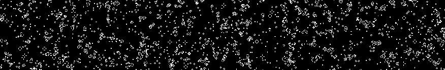

# WebGL Cellular Automata
2-color 8-neighbor [totalistic](https://www.wikiwand.com/en/Cellular_automaton#/Totalistic) 2D cellular automata simulation written in WebGL, with support for dynamically specified rules. 

Totalistic 2D automata are a set of automata that include Conway's Game of Life, which is one of the preset rules. Help me find new interesting rules to include in the presets!

[*Play with it here!*](https://benpm.github.io/webgl-cellular-automata)