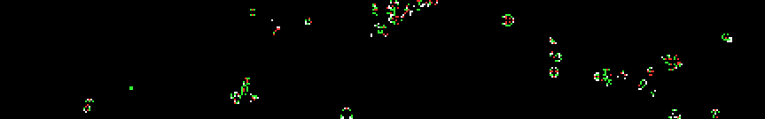

# Cellarium
<*WIP Vue Port*>

Cellular automata zoo that runs in your browser. Simulation is done through a fragment shader so is quite fast.

[*Play with it here!*](https://benpm.github.io/webgl-cellular-automata)

## Controls
### Interaction
- *Left click* to draw cells
- *Right click* to draw state 0 cells (black)
- *Arrow keys* or *middle click* to pan
- *Scroll wheel* to zoom
### Parameters (+ Keyboard Shorcuts)
- **pen size**: Radius of drawing circle in pixels
- **pen state** (*1,2,3,4...*): Cell type to draw with
- **pause** (*spacebar*): Pauses simulation
- **step** (*S*): Pauses, advances simulation by a single step
- **steps per frame**: Number of simulation steps attempted per rendered frame
- **# states**: Interprets rule with this number of states (changing will require new rule)
- **preset**: Various preset rules
- **random rule** (*R*): Generates random rule
- **import rule from clipboard**: Imports compressed rule from clipboard text
- **export rule to clipboard**: Exports compressed rule as text to clipboard
- **rule from text**: Interprets input text as a rule (not the same as import)
- **mutate rule** (*M*): Randomly changes some rule parameters
- **simulation size**: Size of the simulation texture
- **clear** (*C*): Sets state of entire simulation space to 0
- **germinate from center** (*G*): Adds single state-1 cell to center, clearing everything else
- **fill randomly** (*F*): Sets all cells to random states

## Scope
Totalistic 2D automata are a set of automata that include Conway's Game of Life, Wireworld, Brian's Brain, and more, which will be added as presets soon. Help me find new interesting rules to include in the presets!

## How it Works
*Coming soon!*